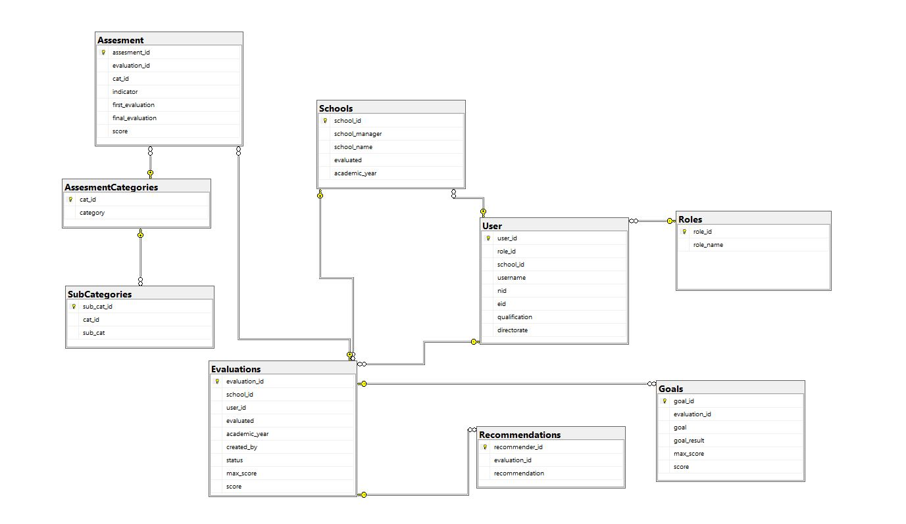

# Performance-Evaluation-Manager

## Pythoneers

### Team Leader : Odeh Abuzaid

### Team members

- Majed Al Swaeer
- Renad Alkhalafat
- Hamza Ahmad
- Odeh Abuzaid

## Overview

Converting Paper-Based Process to a digital environment through an information management system.

The process of evaluating teachers across the country still Paper-Based Process. In Jordan's ministry of education,
performance management system is a mechanism for tracking the performance of teachers consistently and measurably.
It allows the ministry to ensure that teachers and departments across the country are working effectively towards achieving the strategic goals.

## Architecture

> Client First Architecture
  
- Front-End : Next.js
- Back-End : django
- Database : PostgreSQL
- Server : Docker
- Deployment : vercel-Heroku

## [Wireframe](./wireframe/Wireframes.md)

## [Trello Board](https://trello.com/b/U50WFqkZ/pem)

## [Requirements](requirements.md)

## Database

